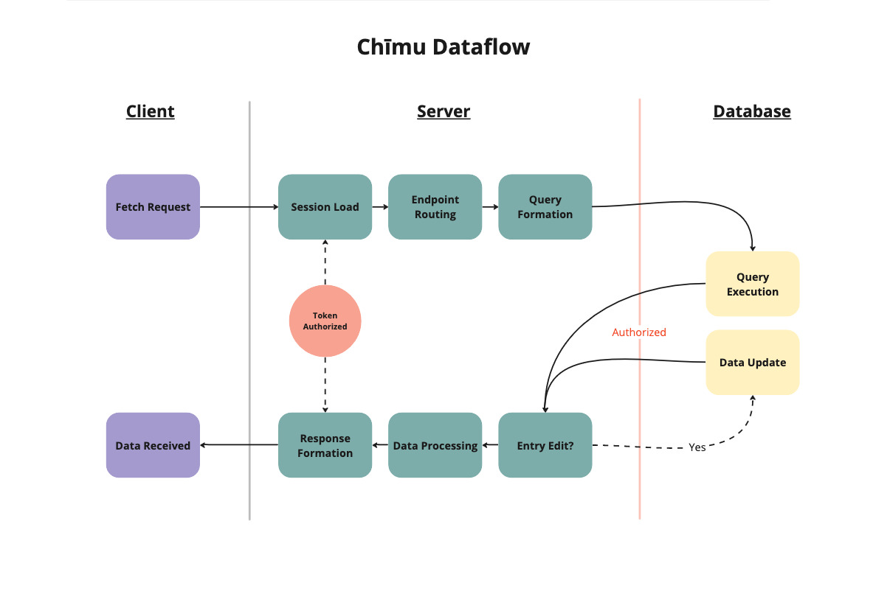

# Chīmu: Teams in Motion
### **University of Washington**
### _Information School Capstone 2023: Team Chimu_
- [Server Repo and Databse Structure](https://github.com/Team-Chimu/tadashi)
- [Client Repo and Design Documentation](https://github.com/Team-Chimu/Chiimu_Frontend)
- [Landing Page](https://team-chimu.github.io/chimu-landing/)

### Authors
- Yiyang (Ian) Wang - Project Manager
  - UW Email: ianuw@uw.edu
  - Personal: yiyang.wa@gmail.com
  - Linkedin: https://www.linkedin.com/in/iwangy/
- Jason Nguyen - Full Stack Developer
  - UW Email: jn69@uw.edu
  - Linkedin:https://www.linkedin.com/in/njason
- Mark Zhang - Back-End Developer
  - UW Email: marquito@uw.edu
  - Linkedin:https://www.linkedin.com/in/markzhang0822
- Anna Younsu Kim - UX Designer
  - UW Email: yskim01@uw.edu
  - Linkedin:https://www.linkedin.com/in/anna-kim-0419251b0
- Youjin Jung - UX Researcher & Designer
  - UW email: youjinj@uw.edu
  - Linkedin:https://www.linkedin.com/in/youjin-jung-

### Site Links
-  Client: [Chīmu Client]() NO LINKS YET
-  Server: [Chīmu Server]() NO LINKS YET

### Additional Documentation
-  Design Docs: [Chīmu Figma](https://www.figma.com/file/fhkwXAdBln63vfel1nE4OR/Team-Chimu?node-id=1%3A2&t=UGYFn1aGtxvoOA2F-1)
---
## About 
Many college students have had a bad team experience. According to an online survey that was conducted consisting of 30 University of Washington students across various majors, approximately 30% of respondents noted that their biggest pain point was communication, and another 40% of respondents noted that their pain point in group work was equity of work among team members. From our research, we found that there are currently no solutions that offer guidance for team collaboration in a class environment.

After conducting concept validations with university students, we identified three core concepts behind what makes a great team: the formation of a team agreement, communication, and conflict resolution. Teams need to establish a team agreement. Team norms and expectations provide formal social pressure and establish open communication. Teams need to communicate from the beginning, middle, and end of their project especially in the beginning as ‘first impressions matter’ and getting to know teammates lends to effective problem-solving and conflict resolution.

Chīmu: Teams in Motion is a mobile-first web application that aims to give the basic framework for how in-class teams can work together effectively to complete their projects. The three core features of our web app are icebreakers, team agreement, and pulse.

### Acknowledgements
This project has been guided under Professor Nam-ho, who has provided insightful feedback and monitored the progress throughout the project timeline.
This project is a continuation of a previous iSchool project, Tadashi. More information can be viewed about this project .

### End of Life
We plan to transition our project into open source, effective May 22nd, 2023. By the transition date, we will have shut down any systems that automatically collect user data. We also will have notified all users that their data will be deleted by this transition date. As for cloud infrastructure, we will shut down our infrastructure with MongoDB and all accounts associated with it. The code repository on GitHub will a public repository with our contact information so any groups can successfully transition to our project.

---
## App
This outlines the general structure and runtime for the Tadashi API server.<br>
For info about deployment, see [Infrastructure](#infrastructure)<br>
For info about data structure, see [Data](#data)<br>
For info about building the application, see [Build](#build)<br>
For info about next steps, see [Continuation](#continuation)

### Runtime
Tadashi uses the node packet manager to handle the build and inclusion of packages.
- [node.js](https://nodejs.org/en/) Version 14.18.0

To handle API requests, ExpressJS is used to route and send data through the web. API requests are structured in a standard REST format.
- [ExpressJS](https://expressjs.com/)

### File Structure
Below is the general outline of the file structre in the Chīmu repo:
```
root
├── database
│   └── database.js (schema)
│
├── routes
│   ├── (functions).js
│   └── api
│       └── (handlers).js
│
├── public
│   └── (api front-end unused)
│
├── app.js (entry)
└── package.json
```
---
## Infrastructure
Chīmu is hosted on two separate deployments, the API and the client. The general purpose is to make management of these services indepenent of one another, without requiring takedown of boths services. This can be changed to a single deployment by merging the client and front end repos.

Our data is on a hosted NoSQL databse. Any hosted cluster that supports standard MongoDB queries shoudl eb interchangeable.

### Services
**Deployment**: Heroku
- Link to Server: [Chīmu Server]() NO LINK
- Link to Client: [Chimu Client]() NO LINK

**NoSQL Databse**: MongoDB Atlas - Free Tier

### Data flow
Dataflow is a straight-forward request and serve structure, where the client requests data via the API routes and is served the related data. 
Most data is reliant on a session token maintained on the server through a cookie. For security reasons, information regarding a organization and/or team requires the logged user to have membership within said org/team. 


---
## Data 
The goal of the database structure is to allow flexibility in further development for organization features while allowing the user to have full functionality in multiple organizations. To accomplish this, only the organization does not hold any references to any other schemas except for the user. It is the job of the other schemas such as team agreement and pulse hold references to the org so future features can use this same pattern to easily connect to the organization without having to change any details of the organization.

### Schema
Below is a diagram of our logical schema structure. Note that this is only logical and not the physical implementation.

For a detailed list of available fields and connections, consult `database/database.js`.

 

### API 
The API is structured in a REST-like format, with GET, POST, PUT, DELETE entries for most endpoints. Endpoints have been tested, however, further testing is required and should be automated going forward. For additional information on payloads, type returns, and expected functionality, consult comments preceding routes.

API functionality is not extensive but sufficient for current implented client activities.

Domain: NO LINK YET

**Routes**

**/boom**
- DELETE /: Deletes everything in database
**/login**
- POST /signin: Signs users in with email and password
- POST /signup: Signs up users
- POST /signout: Signs out users

**/api/users**
- GET /self : Returns current user information for session
- PUT /setpic: Sets users’ profile picture
- GET /:userid : Returns users information
- PUT /:userid : Edits users information
- PUT /information/:userid: Edits users’ personal information
- DELETE /:userid : Deletes references to user

**/api/org**
- POST /create: Create new team
- GET /:orgid: Returns team information
- PUT /:orgid: Edits team information
- POST /:orgid/leave: Remove logged user from specified team
- GET /:orgid/viewed: switch user status to viewed profiles
- POST /:orgid/kick: Remove a user from a specified team

**/api/orgAccessCode**
- POST /create: Create a new access code for members to join
- GET /:accesscode: Get details from users currently in the group
- DELETE /delete: delete access code
- POST /join: Join the group using the access code

**/api/teamAgreement**
- GET /:orgid: Returns team agreement information
- POST /create: Create team agreement for a specified team
- PUT /:orgid: Modify team agreement for a specified team
- DELETE /:orgid: Delete team agreement for a specified team

**/api/userprofile**
- GET /:orgid/:userid: Returns user profile for a specified user
- POST /create: Create user profile for a specified user
- PUT /:orgid/:userid: Modify user profile for a specified user
- DELETE /:orgid/:userid: Delete user profile for a specified user

**/api/pulse**
- GET /:orgid/:week: Return the average of pulse result for a specified team and week
- POST /create/:orgid/:week: Submit pulse for a specified user

### Postman

Install Postman [here](https://www.postman.com/).

A catalog of endpoints using the local deployment can be found in file: `./database/Tadashi_v3.postman_collection.json`. Import the file into Postman environment to load local (localhost:3000) endpoints.

Endpoints should work locally using Postman and login cookies can be saved by first calling endpoint `Login/Signin` before restricted endpoints.

---
## Build

Steps on how to build and deploy a working version of our application:

### Local

- **Database**
  - Install MongoDB Server
      - (**Mac**): [Install MongoDB Community Edition](https://www.mongodb.com/docs/manual/tutorial/install-mongodb-on-os-x/)
  - (Recommended) Install MongoDBCompass
    - Used to view data using GUI
  - Instance a local MongoDB Server
    - (**Windows**) `mongod.exe --dbpath="c:\code\mongodbData\testdb\"`
    - (**Mac**) `brew services start mongodb-community@5.0`
  - (Optional) Populate with sample data manually
- **Server**
  - Clone Server Repository `UPDATE REPO NAME` **EDIT**
  - Install node packages using `npm install` from terminal
  - In tadashi root direcory, create file `.env`
    - File Content: `MONGODB_URI=mongodb://localhost/chimu`
  - Start server with `npm start` from terminal
- **Client**
  - Clone Server Repository `UPDATE REPO NAME` **EDIT**
  - Install node packages using `npm install` from terminal
  - Change fetch domain location to `http://localhost:3000`
  - Start client with `npm run start` from terminal

### Deployment

**Server**
TO BE UPDATED **EDIT**
**Client**
TO BE UPDATED **EDIT**

---
## Continuation

Listed below is our suggestion on how this project may be continued forward. This includes items of varying urgency and/or complexity that have come up through ongoing development.

This section is not meant to be authoritative nor exhaustive. It is meant to guide future teams on what they might seek to investigate going forward.

### Next Steps

- Profile editing functionality and UI design in the front-end
- Profile deletion functionality and UI design in the front-end
- Organization editing functionality and UI design in the front-end
- Organization deletion functionality and UI design in the front-end

### Known Issues
- The same account can be logged in at the same time on 2 different devices which can cause issues like joining your own group

### Suggestions
- Group staging area can be redone in the front-end and back-end to use a websocket implementation instead of a heartbeat approach.
- Remove unnecessary end-points that were created in the previous iteration of the project
- Find a way to check the authorization of the user without calling /self endpoint on every page


